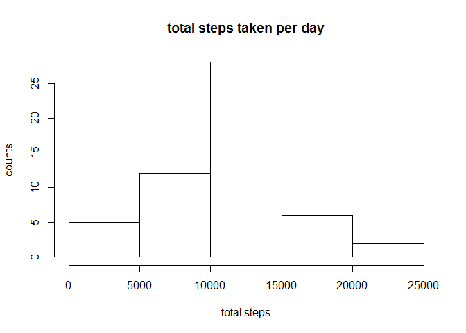
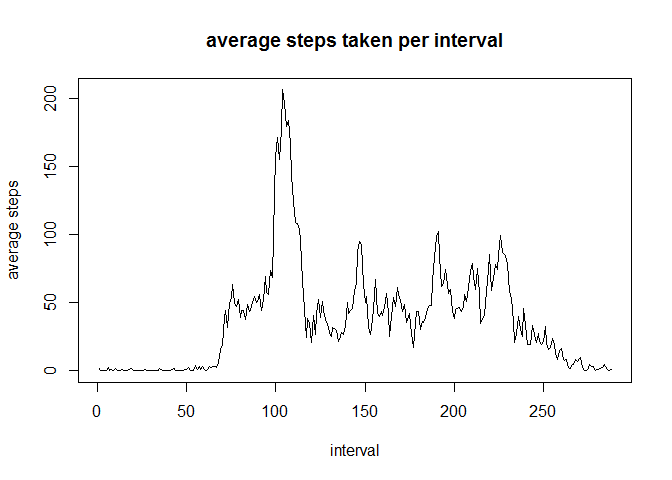
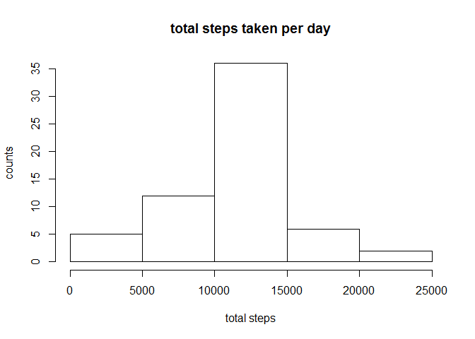
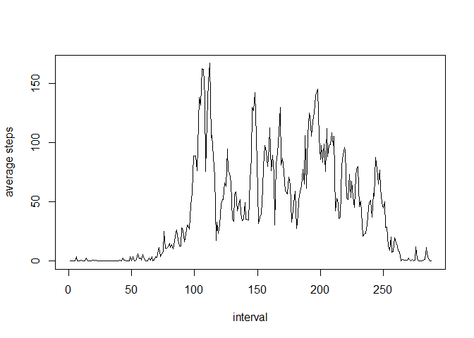
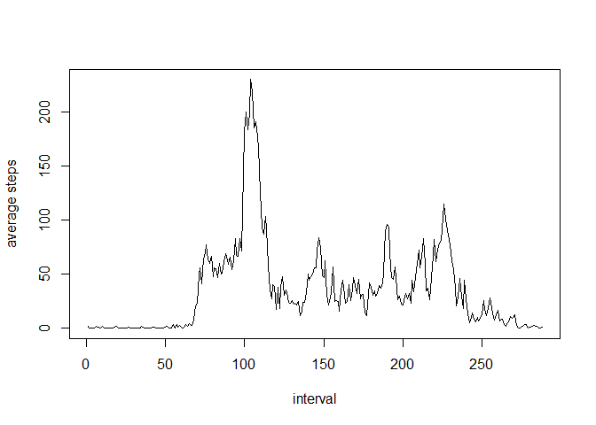

# Reproducible Research: Peer Assessment 1

## Loading and preprocessing the data


```r
library(plyr)
base_dir <- "C:/Users/Scott/Documents/coursera/data_science_specialization/"
course_dir <- paste0(base_dir, "reproducible_research/week_2/project_1")
setwd(course_dir)
activityRaw <- read.csv("activity.csv")
activity <- na.omit(activityRaw)
activity$date <- as.Date(activity$date)
```

## What is mean total number of steps taken per day?


```r
totalSteps <- ddply(activity, "date", summarize, steps = sum(steps, na.rm = TRUE))
hist(totalSteps$steps, xlab = "total steps", ylab = "counts", main = "total steps taken per day")
```

<!-- -->

```r
meanTotalSteps <- mean(totalSteps$steps)
medianTotalSteps <- median(totalSteps$steps)
```

Mean = $1.0766189\times 10^{4}$, median = $10765$.

## What is the average daily activity pattern?


```r
averagePattern <- ddply(activity, "interval", summarize, steps = mean(steps, na.rm = TRUE))
plot(averagePattern$steps, type = "l", xlab = "interval", ylab = "average steps", main = "average steps taken per interval")
```

<!-- -->

Max interval (on average across all days) = 104.

## Imputing missing values


```r
totalNA <- sum(is.na(activityRaw$steps))

activity <- activityRaw
activity$date <- as.Date(activity$date)
for (i in 1:nrow(activity)) {
  if (is.na(activity[i, 1])) {
    j <- which(averagePattern$interval == activity[i, 3])
    activity[i, 1] <- averagePattern[j, 2]
  }
}

totalSteps <- ddply(activity, "date", summarize, steps = sum(steps, na.rm = TRUE))
hist(totalSteps$steps, xlab = "total steps", ylab = "counts", main = "total steps taken per day")
```

<!-- -->

```r
meanTotalSteps <- mean(totalSteps$steps)
medianTotalSteps <- median(totalSteps$steps)
```

NA rows = 2304.  

Mean = $1.0766189\times 10^{4}$, median = $1.0766189\times 10^{4}$.

## Are there differences in activity patterns between weekdays and weekends?


```r
activity$isWeekend <- factor(weekdays(activity$date) %in% c("Saturday", "Sunday"), levels = c(FALSE, TRUE))
averagePattern <- ddply(activity, c("interval", "isWeekend"), summarize, steps = mean(steps, na.rm = TRUE))
temp = subset(averagePattern, isWeekend == TRUE)
plot(temp$steps, type = "l", xlab = "interval", ylab = "average steps")
```

<!-- -->

```r
temp = subset(averagePattern, isWeekend == FALSE)
plot(temp$steps, type = "l", xlab = "interval", ylab = "average steps")
```

<!-- -->
